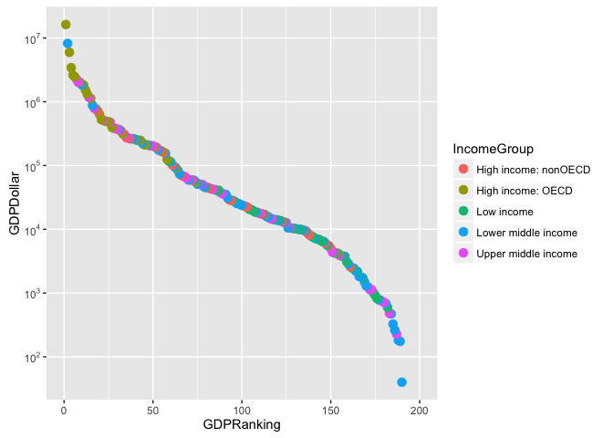
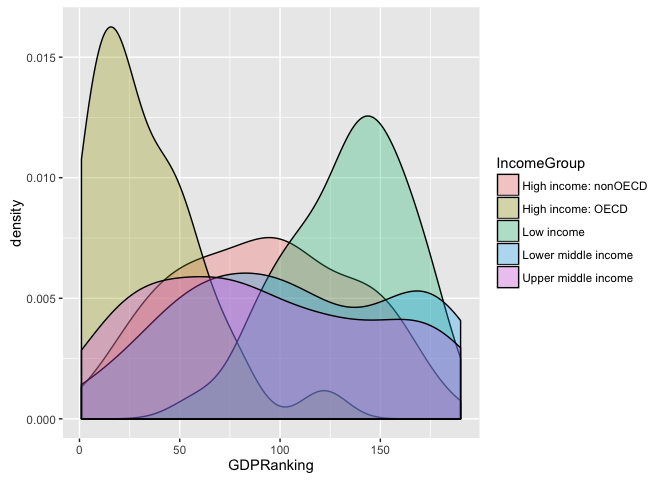

# Investigating the Correlation Between GDP and Income Group
Brian Gobran Section 403  
10/11/2016  


## Introduction
#### The purpose of this project is to investigate the relationship between GDP and income level for 190 countries.  To perform this investigation, two files are used: a GDP compilation for 190 countries and a compilation of some educational data by country.  The main items of interest in the GDP data are the countries, their GDP values, and their GDP ranking.  The main (additional) information from the educational data is the income group for each country.  From the merging of these two datasets, we will determine if there is a relationship between income group and the GDP (or GDP ranking) for these countries.

## Code
#### The code (written in R) used for this analysis is divided into 11 distinct files with a set of make-file type commands at the end of this section.  One unique feature of the code is a "debug" variable.  This variable is initialized to 1 in the init.R (first) file.  Setting the variable to 1 causes significantly more information to be printed.  Setting it to 0 supresses that printing.  The user can optionally use "debug <- 0" or "debug <- 1" commands between the make-file source commands to increase or decrease the information printed at various steps in the analysis.

#### The 11 files in the order they are sourced and the actions they perform are:

######   **init.R** --------------- Initialize the debug variable to control output and to load the packages needed for the entire case study
######   **gatherGDP.R** ----- Obtain the GDP file
######   **gatherEDU.R** ----- Obtain the Education file
######   **tidyGDP.R** ------- Tidy (clean up by renaming variables, changing the variable types) the GDP data frame, given what we can tell about the variables
######   **tidyEDU.R** ------- Tidy (clean up by renaming variables, changing the variable types) the EDU data frame, given what we can tell about the variables
######   **merge.R** --------- Check the number of rows we should expect after the merge, perform the merge, perform cleanup, and remove unused columns
######   **Question1.R** ----- Answer the first question on the merged data: "How many of the IDs match?"
######   **Question2.R** ----- Answer the second question on the merged data after sorting: "What is the 13th country in the resulting data frame?"
######   **Question3.R** ----- Answer the third question on the merged data: "What are the average GDP rankings for 'High income: OECD' and 'High income:nonOECD' groups?"
######   **Question4.R** ----- Answer the fourth item on the merged data: "Plot the GDP for all countries. Use gglot2 to color the plot by Income Group."
######   **Question5.R** ----- Address the fifth question on the merged data: "Cut the GDP rankings into 5 separate quantile groups.  Make a table versus Income Group. How many countries are Lower middle income but among the 38 nations with highest GDP?"


#### The main variables of interest in the order they appear and what they represent are:

######   **URLGDP** ------ a vector containing the GDP URL  
######   **URLEDU** ------ a vector containing the educational data URL   
######   **GDP** ------ a data frame containing the GDP data  
######   **EDU** ------ a data frame containing the educational data    
######   **check** ------ a vector of length 190 containing "match" or "No Match" to check how many countries were in both files     
######   **merged** ------ a data frame containing the GDP and EDU data
######   **bad** ------ a vector containing values for GDP rankings of NA
######   **keep** ------ a vector containing column numbers of the merged data frame to be kept
######   **mergedReduced** ------ a subset of the merged data frame containing only the columns to be used in the study
######   **mergedReducedSorted** ------ the merged data frame (after missing GDP ranking rows and unneeded columns were removed) sorted by GDP ranking descending
######   **OECDGDP** ------ a vector of GDP rankings for the High income: OECD countries
######   **NONOECDGDP** ------ a vector of GDP rankings for the High income: nonOECD countries
######   **GDPGroup** ------ an empty numeric vector of length 189
######   **TopLMI** ------ a vector of GDP rankings for the Lower middle income group


```r
setwd("~/Documents/SMU Classes/03_Data_Science/CaseStudy1/CaseStudyProject")
source("data/init.R")
```

```
## 
## Attaching package: 'dplyr'
```

```
## The following objects are masked from 'package:stats':
## 
##     filter, lag
```

```
## The following objects are masked from 'package:base':
## 
##     intersect, setdiff, setequal, union
```

```r
source("data/gatherGDP.R")
source("data/gatherEDU.R")
source("data/tidyGDP.R")
source("data/tidyEDU.R")
source("data/merge.R")
```

```
## Of the 190 countries in the GDP file, SSD, or South Sudan, is not in the Education file.
```

```r
source("analysis/Question1.R")
```

```
## The number of rows that matched is 189
```

```r
source("analysis/Question2.R")
```

```
## The 13th country in the list is St. Kitts and Nevis
```

```r
source("analysis/Question3.R")
```

```
## The mean GDP ranking of the High Income: OECD countries is     32.967
```

```
## The mean GDP ranking of the High Income: non OECD countries is 91.913
```

```r
source("analysis/Question4.R", print.eval=TRUE)
```

<!-- -->

```r
source("analysis/Question5.R", print.eval=TRUE)
```

```
## In the table below, the GDP quantiles are rows indicated by the numbers 1 through 5 on the left.  The Income Groups are listed across the top.  The elements of the table indicate number of countries corresponding to the GDP quantile and Income Group.
```

```
##    
##     High income: nonOECD High income: OECD Low income Lower middle income
##   1                    4                18          0                   4
##   2                    5                10          1                  14
##   3                    8                 1          9                  11
##   4                    4                 1         15                   9
##   5                    2                 0         12                  16
##    
##     Upper middle income
##   1                  11
##   2                   8
##   3                   9
##   4                   8
##   5                   9
```

```
## The number of Lower middle income countries in the top 38 GDP are 5
```

### Answers to Questions
#### The answers to the questions, a succinct compilation of those provided through running the code, are

##### Question 1: There are 189 countries in the merged dataset.  South Sudan (SSD) is in the GDP file but not in the Education file.
##### Question 2: St. Kitts and Nevis is the 13th country from the bottom in terms of GDP ranking
##### Question 3: The mean GDP ranking of the High Income: OECD countries is 32.967 while the mean GDP ranking of the High Income: non OECD countries is 91.913.
##### Question 4: In the first graph below, if there was a correlation between GDP (either ranking or dollar amount) and the income level, the colors of the dots would be grouped.  For example, we would see (either looking left to right or top to bottom) one color followed by another color followed by another color, etc.  However, we do not see that.  We see a mixing of the colors (income groups) showing that there is no well-defined correlation.  The second graph shows the same spread of GDP ranking by income group (Question 5).  We can see clearly here that three of the income groups have countries that span the entire range of GDP rankings.  The graphs follow:

<!-- --><!-- -->

##### Question 5: There are 5 countries in the Lower middle income group in the top 38 GDP countries.  From this table (with the GDP quantiles as rows indicated by the numbers 1 through 5 on the left, the Income Groups listed across the top, and the elements of the table indicating number of countries corresponding to the GDP quantile and Income Group), we see that each income group has member countries in at least four of the five GDP quantile groups.  In this case, if there was a strong correlation, we would expect the income groups spread over fall fewer GDP groups.  Because of the spread of the income groups over the GDP groups, these data, too, indicate that there is no strong correlation between GDP ranking and income group.  The table is below:


```
##    
##     High income: nonOECD High income: OECD Low income Lower middle income
##   1                    4                18          0                   4
##   2                    5                10          1                  14
##   3                    8                 1          9                  11
##   4                    4                 1         15                   9
##   5                    2                 0         12                  16
##    
##     Upper middle income
##   1                  11
##   2                   8
##   3                   9
##   4                   8
##   5                   9
```

### Conclusion
##### By merging these two datasets, we are able to look at the relationship between GDP (either in terms of millions of dollars or ranking) and the income groups.  We did this in two disctinct ways: graphically and tabularly.  In the first graph from Question 4, if there was a correlation between GDP (either ranking or dollar amount) and the income level, the colors of the dots would be grouped.  For example, we would see (either looking left to right or top to bottom) one color followed by another color followed by another color, etc.  However, we do not see that.  We see a mixing of the colors (income groups) showing that there is no well-defined correlation.  The second graph shows the same spread of GDP ranking by income group.  We can see clearly here that three of the income groups have countries that span the entire range of GDP rankings.

##### When looking at the tabular data from Question 5, we see that each income group has member countries in at least four of the five GDP quantile groups.  In this case, if there was a strong correlation, we would expect the income groups spread over fall fewer GDP groups.  Because of the spread of the income groups over the GDP groups, these data, too, indicate that there is no strong correlation between GDP ranking and income group.

#### Therefore, the conclusion from this study is that the currently defined income groups do not correlate with the country's GDP based on these data.


